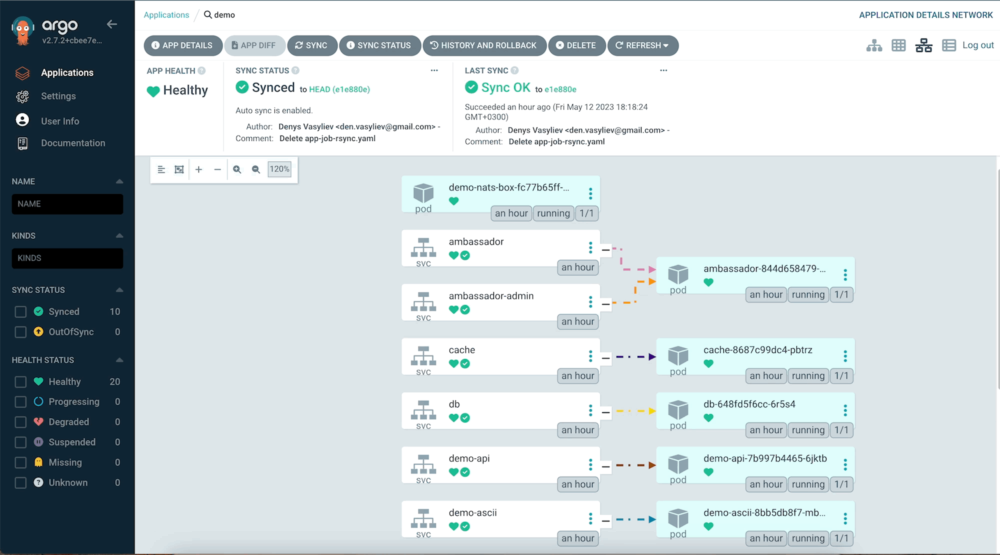

# MVP Document: ArgoCD Application Deployment

## Objective:
Create an application in ArgoCD that will monitor the product's Git repository https://github.com/den-vasyliev/go-demo-app and set up automatic synchronization.

## Steps:

### Step 1: Install ArgoCD Operator
```
kubectl create namespace argocd

kubectl get namespace argocd 

kubectl apply -n argocd -f https://raw.githubusercontent.com/argoproj/argo-cd/stable/manifests/install.yaml

kubectl get all -n argocd
```

### Step 2: Expose ArgoCD Server
```
kubectl port-forward svc/argocd-server -n argocd 8080:443
```

### Step 3: Log in to the ArgoCD web interface using the default username and password:
```
Username: admin
Password: get from command: 

  kubectl -n argocd get secret argocd-initial-admin-secret -o jsonpath="{.data.password}" | base64 -d; echo
```


### Step 4: Add Git Repository as Source to ArgoCD
- Log in to the ArgoCD web interface using the URL: https://localhost:8080/
- Click on the "New App" button on the top of the screen.
- Fill in the fields in the "New Application" form. For the Git repository source field, enter the URL of the Git repository: https://github.com/den-vasyliev/go-demo-app. For the target environment, enter "development".
- Click "Create". ArgoCD will now automatically detect changes in the repository and deploy them to the target environment.

### Step 5: Create Kubernetes Manifest File
- Use the following example manifest file:
```
apiVersion: argoproj.io/v1alpha1
kind: Application
metadata:
  name: demo
spec:
  destination:
    name: ''
    namespace: demo
    server: 'https://kubernetes.default.svc'
  source:
    path: helm
    repoURL: 'https://github.com/den-vasyliev/go-demo-app'
    targetRevision: HEAD
    helm:
      valueFiles:
        - values.yaml
  sources: []
  project: default
  syncPolicy:
    automated:
      prune: true
      selfHeal: true
    syncOptions:
      - CreateNamespace=true
```
- Save the manifest file to a Git repository.

### Step 5: Create ArgoCD Application
- Log in to the ArgoCD web interface using the URL: https://localhost:8080/
- Click on the "New App" button on the top right corner of the screen.
- Fill in the fields in the "New Application" form. For the Git repository source field, enter the URL of the Git repository: https://github.com/den-vasyliev/go-demo-app. For the "Path", enter *helm*.
- In the "DESTINATION" section, click on "Cluster URL" and enter https://kubernetes.default.svc. For the "Namespace", enter *demo*.
- Click "Create". ArgoCD will now automatically deploy the application to the target environment, and any changes made to the Git repository will trigger a redeployment of the application.

[](https://share.cleanshot.com/VkgLN2jv "Video example")

### Step6: Test
- To test automatic deployments, we can change the image tag in the Deployment manifest file and wait for 3 seconds to automatically deploy the change. We can see the deployment status from the Argo CD UI.

## Conclusion
By following these steps, you should be able to create an application in ArgoCD that will monitor the product's Git repository and set up automatic synchronization.