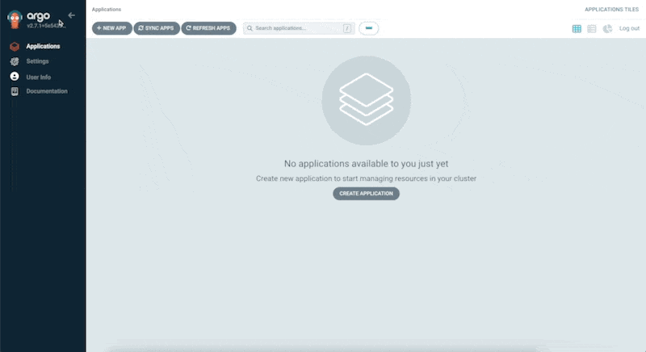

# How to install ArgoCD
```bash
# create k3d cluster
k3d cluster create argo

# install core ArgoCD components only:
kubectl create namespace argocd
kubectl apply -n argocd -f https://raw.githubusercontent.com/argoproj/argo-cd/stable/manifests/install.yaml

# check
kubectl get all -n argocd
kubectl get po -n argocd -o wide

# port forward tu GUI
kubectl port-forward svc/argocd-server -n argocd 8080:443

# get plaint text password ArgoCD
kubectl -n argocd get secrets argocd-initial-admin-secret -o jsonpath="{.data.password}" | base64 --decode; echo
```
**Demonstration ArgoCD GUI:**

URL: https://localhost:8080



```bash
# get API token
curl -k  https://127.0.0.1:8080/api/v1/session -d $'{"username":"admin","password":"XXXXXXXXXX"}'
read -s  ARGOCD_TOKEN
export ARGOCD_TOKEN

# get api version
curl -k -H "Authorization: Bearer $ARGOCD_TOKEN" https://127.0.0.1:8080/api/version | jq
```